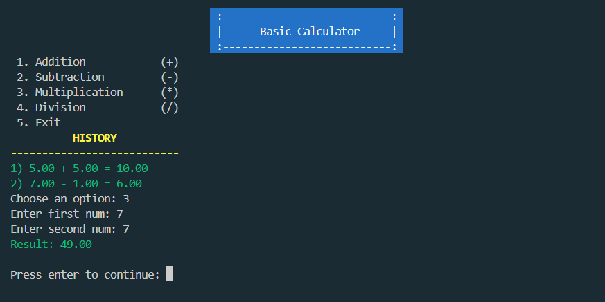

# Basic Calculator in C
- Simple Calculator written in c.
---
## Features:
- Can perform basic operations: 
    - Addition 
    - Subtraction 
    - Multiplication
    - Division
- Show previous Operation history
- Colored Terminal User Interface
---
## Output

## Author 
Shlok Kumar
